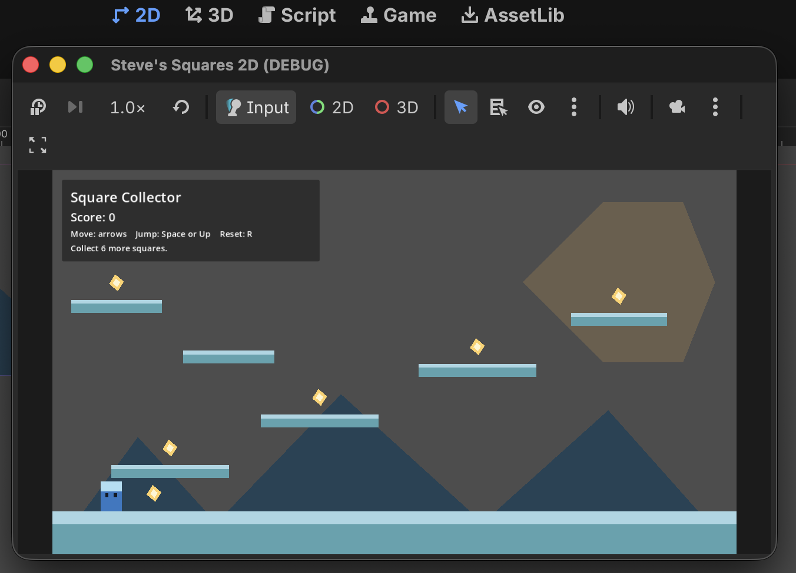
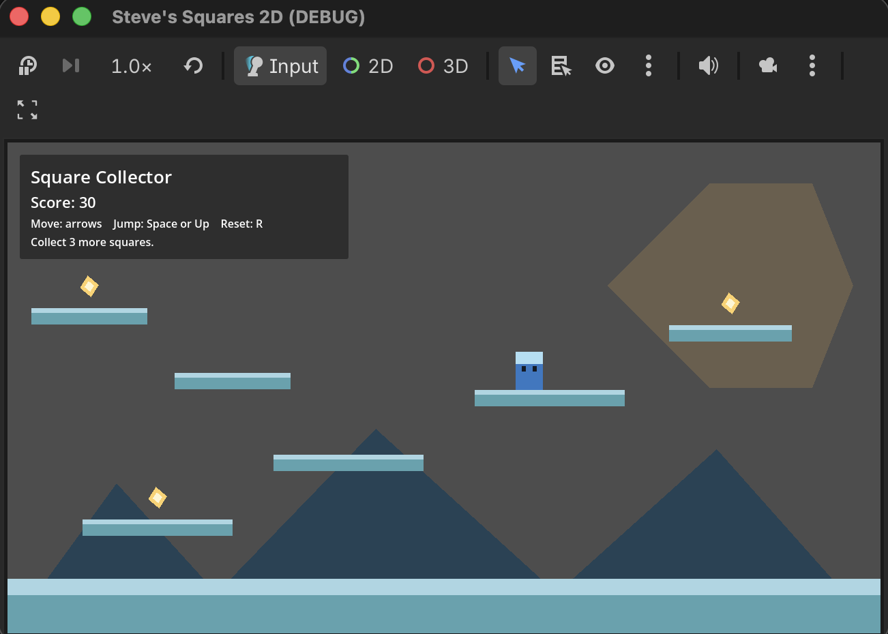

# Steve's Squares

A fun 2D platformer game built with **Godot** and **GDScript**. Navigate through challenging platforms, collect items, and reach the top to score points!

## About the Game

Steve's Squares is a casual platformer where you control a character navigating through a series of progressively challenging platforms. Jump your way up, collect all the items on each level, and try to get the highest score possible!

### Features
- **Simple Controls**: Move left/right and jump to navigate
- **Platforming Gameplay**: Jump across moving platforms at different heights
- **Collectibles**: Gather items scattered throughout each level
- **Score Tracking**: Monitor your progress with real-time score display
- **Easy Restart**: Press R anytime to restart the level and try again
- **Smooth Movement**: Fluid jumping mechanics with gravity physics

## Screenshots

### Initial Gameplay


### Into the Gameplay


## How to Run

### Requirements
- **Godot 4.6** or higher ([Download here](https://godotengine.org/download))

### Steps

1. **Open Godot Editor**
   - Launch the Godot Engine application

2. **Open the Project**
   - Click "Open" in the project manager
   - Navigate to the `steves-squares-godot` folder
   - Select and open the project

3. **Run the Game**
   - Press the **Play** button (▶️) in the top-right corner of the editor
   - Or use the keyboard shortcut: **F5**

4. **Controls**
   - **Left/Right Arrow Keys**: Move the character
   - **Space/Up Arrow**: Jump
   - **R Key**: Restart the level

## Project Structure

```
scenes/
  ├── main.tscn         # Main level scene
  ├── player.tscn       # Player character scene
  └── collectible.tscn  # Collectible items scene

scripts/
  ├── main.gd           # Level logic and platform management
  ├── player.gd         # Player movement and physics
  └── collectible.gd    # Collectible interaction logic

project.godot           # Godot project configuration
```

## Development

This project uses **GDScript**, Godot's Python-like scripting language. The game is organized into three main systems:

- **Player System**: Handles character movement, jumping, and collision detection
- **Level System**: Manages platforms, collectibles, and scoring
- **Collectible System**: Tracks item collection and score updates

Enjoy the game! 🎮
